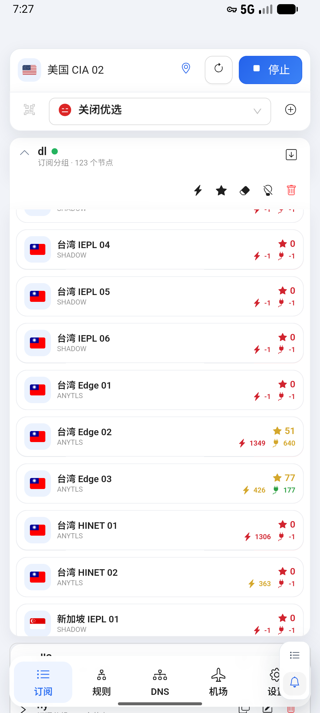
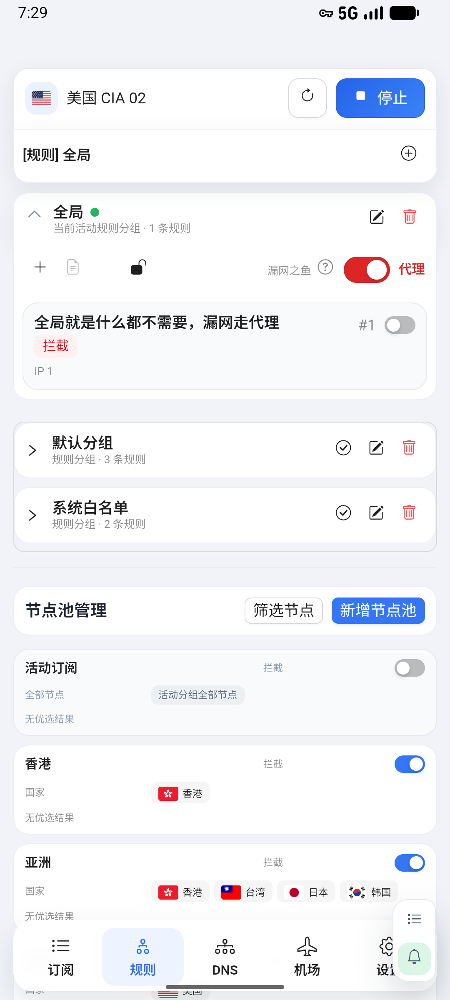
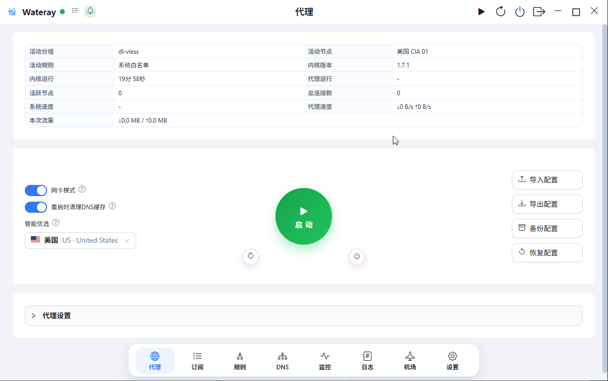
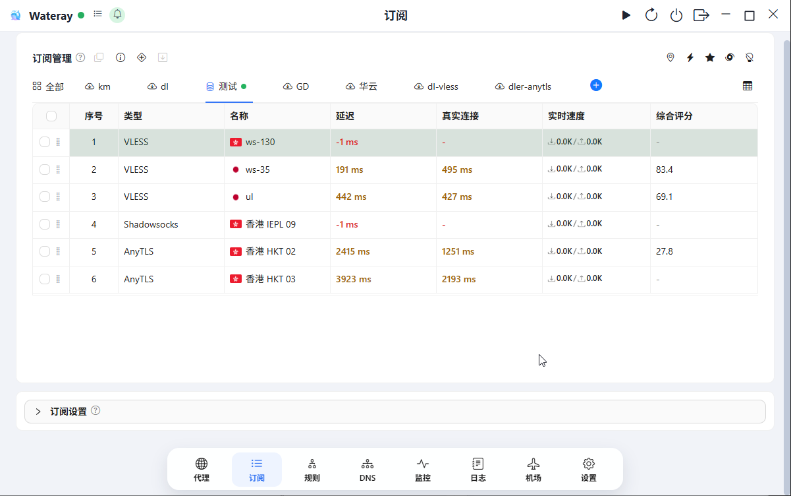
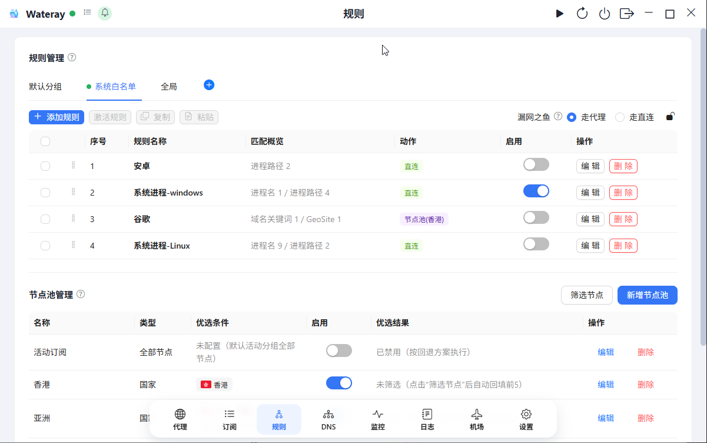
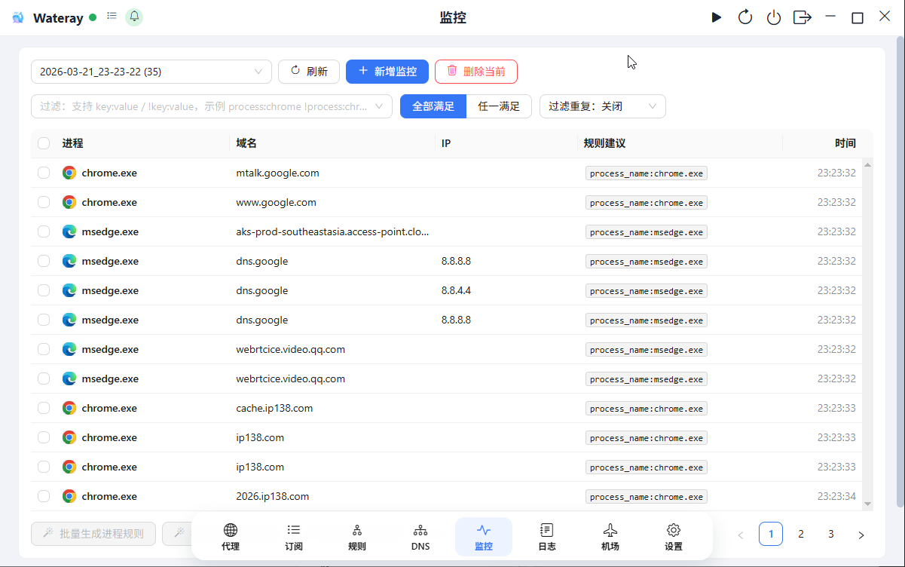

# Wateray Release

官网：[https://wateray.net/](https://wateray.net/)

Wateray 的公开发布仓库，用于分发已纳入公开发布流程的平台客户端安装包、版本说明与升级索引文件。
此 README 由发布流程自动更新。

## 当前稳定版本

- 版本：`1.7.2`
- 发布渠道：稳定版
- 当前公开发布平台：Windows（ZIP 整包）, Linux（ZIP / DEB / AppImage）, Android（APK）
- Release 页面：[Wateray v1.7.2](https://github.com/water-ray/wateray-release/releases/tag/v1.7.2)
- 全部版本：[查看 Releases](https://github.com/water-ray/wateray-release/releases)

## 更新摘要
- 新功能：本次版本未记录独立新功能。
- 修复：修复安卓构建问题；修复拖拽问题；Ss混淆插件解析
- 优化：优化评分；优化TLS连接,增加缓存机制,修复历史遗留自动urltest问题；优化git代码提交
- 兼容性说明：当前公开发布包包含：Windows（ZIP 整包）, Linux（ZIP / DEB / AppImage）, Android（APK）。请按对应平台下载使用。

## 下载文件

### Windows（ZIP 整包）

- [Wateray-windows-v1.7.2.zip](https://github.com/water-ray/wateray-release/releases/download/v1.7.2/Wateray-windows-v1.7.2.zip)：Windows ZIP 便携整包（16.89 MB，推荐下载）

### Linux（ZIP / DEB / AppImage）

- [Wateray-linux-v1.7.2.zip](https://github.com/water-ray/wateray-release/releases/download/v1.7.2/Wateray-linux-v1.7.2.zip)：Linux ZIP 便携整包（19.00 MB，推荐下载）
- [wateray_1.7.2_amd64.deb](https://github.com/water-ray/wateray-release/releases/download/v1.7.2/wateray_1.7.2_amd64.deb)：Linux Debian/Ubuntu 安装包（15.67 MB）
- [Wateray-linux-v1.7.2-x86_64.AppImage](https://github.com/water-ray/wateray-release/releases/download/v1.7.2/Wateray-linux-v1.7.2-x86_64.AppImage)：Linux AppImage 便携包（18.44 MB）

### Android（APK）

- [Wateray-Android-v1.7.2-arm64-release.apk](https://github.com/water-ray/wateray-release/releases/download/v1.7.2/Wateray-Android-v1.7.2-arm64-release.apk)：Android arm64 APK 安装包（72.50 MB，推荐下载）
- [Wateray-Android-v1.7.2-x86_64-release.apk](https://github.com/water-ray/wateray-release/releases/download/v1.7.2/Wateray-Android-v1.7.2-x86_64-release.apk)：Android x86_64 APK 安装包（76.42 MB）

## 客户端界面截图

以下截图存放在仓库 `images/screenshots/` 目录，便于在 Release 页面之外快速了解客户端主要界面。

### Android 客户端

- 安卓客户端：代理运行与订阅节点列表

- 安卓客户端：规则分组与节点池管理

### Windows / Linux 桌面端

桌面端在 Windows 与 Linux 上保持相同的信息架构与主操作流，以下截图展示核心页面布局。

- Windows / Linux 桌面端：代理主页与启动控制

- Windows / Linux 桌面端：订阅列表与节点评分

- Windows / Linux 桌面端：规则管理与节点池

- Windows / Linux 桌面端：请求监控与规则建议

## 附加文件

- [SHA256SUMS.txt](https://github.com/water-ray/wateray-release/releases/download/v1.7.2/SHA256SUMS.txt)：发布文件校验值。
- [latest.json](https://github.com/water-ray/wateray-release/releases/download/v1.7.2/latest.json)：机器可读版本摘要。
- [latest-github.json](https://github.com/water-ray/wateray-release/releases/download/v1.7.2/latest-github.json)：带 GitHub 下载地址的版本摘要。
- [本次版本说明](https://github.com/water-ray/wateray-release/releases/tag/v1.7.2)：查看完整 Release Notes。

## 说明

- 该仓库默认只保留公开发布所需文件，不包含源码与开发文档。
- 最终可下载平台以本 README 与对应 Release 附件为准。
