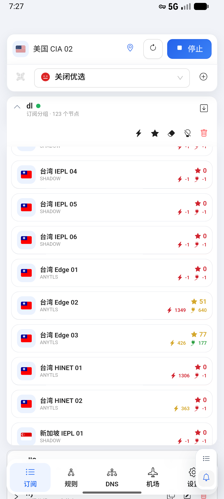
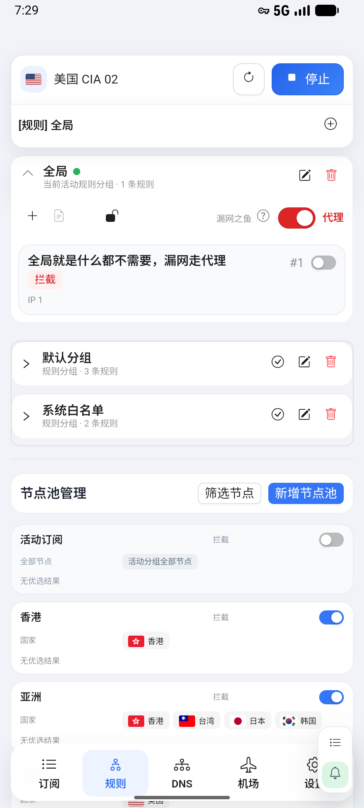
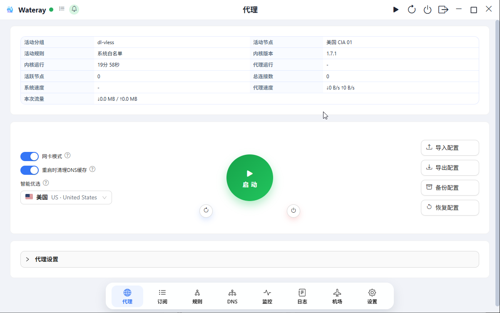
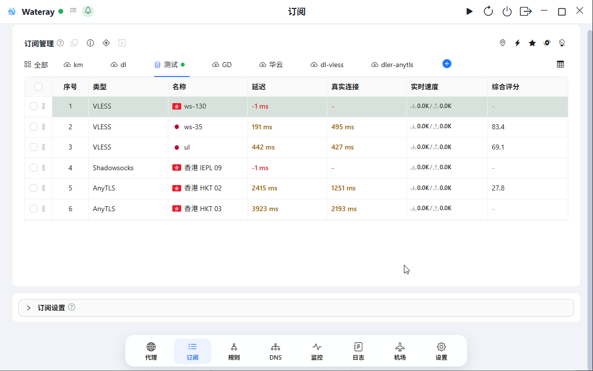
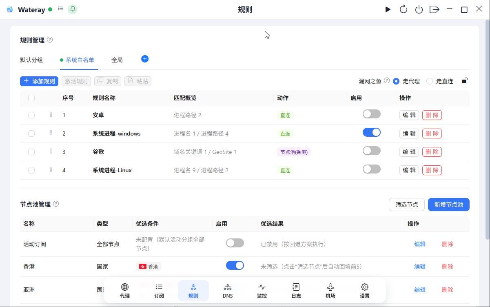
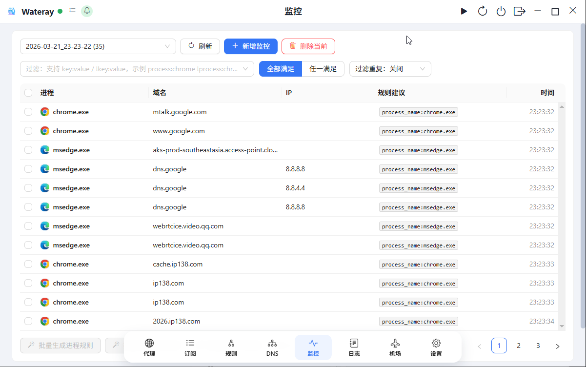

# Wateray Release

官网：[https://wateray.net/](https://wateray.net/)

Wateray 的公开发布仓库，用于分发已纳入公开发布流程的平台客户端安装包、版本说明与升级索引文件。
此 README 由发布流程自动更新。

## 当前稳定版本

- 版本：`2.1.1`
- 发布渠道：稳定版
- 当前公开发布平台：Windows（ZIP 整包）, Linux（ZIP / DEB / AppImage）, Android（APK）
- 本次未发布：macOS（DMG 安装镜像）（本次无更新，无发布版本）
- Release 页面：[Wateray v2.1.1](https://github.com/water-ray/wateray-release/releases/tag/v2.1.1)
- 全部版本：[查看 Releases](https://github.com/water-ray/wateray-release/releases)

## 更新摘要
- 完全解决因句柄泄露造成的内核崩溃问题。
- 节点表格右键“全选”改为按类型分类选择。
- DNS自定义hosts支持泛域名方式 "127.0.0.1 qq.com *.qq.com"
- 增加 TUN 路由排除 - 使固定IP明确不由TUN入站，直接直连，重启刷新代理直连游戏不掉线。
- 兼容性说明：当前公开发布包包含：Windows（ZIP 整包）, Linux（ZIP / DEB / AppImage）, Android（APK）。请按对应平台下载使用。

## 下载文件

### Windows（ZIP 整包）

- [Wateray-windows-v2.1.1.zip](https://github.com/water-ray/wateray-release/releases/download/v2.1.1/Wateray-windows-v2.1.1.zip)：Windows ZIP 便携整包（17.59 MB，推荐下载）

### Linux（ZIP / DEB / AppImage）

- [Wateray-linux-v2.1.1.zip](https://github.com/water-ray/wateray-release/releases/download/v2.1.1/Wateray-linux-v2.1.1.zip)：Linux ZIP 便携整包（19.75 MB，推荐下载）
- [wateray_2.1.1_amd64.deb](https://github.com/water-ray/wateray-release/releases/download/v2.1.1/wateray_2.1.1_amd64.deb)：Linux Debian/Ubuntu 安装包（16.14 MB）
- [Wateray-linux-v2.1.1-x86_64.AppImage](https://github.com/water-ray/wateray-release/releases/download/v2.1.1/Wateray-linux-v2.1.1-x86_64.AppImage)：Linux AppImage 便携包（19.11 MB）

### Android（APK）

- [Wateray-Android-v2.1.1-arm64-release.apk](https://github.com/water-ray/wateray-release/releases/download/v2.1.1/Wateray-Android-v2.1.1-arm64-release.apk)：Android arm64 APK 安装包（51.02 MB，推荐下载）
- [Wateray-Android-v2.1.1-x86_64-release.apk](https://github.com/water-ray/wateray-release/releases/download/v2.1.1/Wateray-Android-v2.1.1-x86_64-release.apk)：Android x86_64 APK 安装包（54.21 MB）

### macOS（DMG 安装镜像）

- 本次无更新，无发布版本。

## 客户端界面截图

以下截图存放在仓库 `images/screenshots/` 目录，便于在 Release 页面之外快速了解客户端主要界面。

### Android 客户端

- 安卓客户端：代理运行与订阅节点列表

- 安卓客户端：规则分组与节点池管理

### Windows / Linux 桌面端

桌面端在 Windows 与 Linux 上保持相同的信息架构与主操作流，以下截图展示核心页面布局。

- Windows / Linux 桌面端：代理主页与启动控制

- Windows / Linux 桌面端：订阅列表与节点评分

- Windows / Linux 桌面端：规则管理与节点池

- Windows / Linux 桌面端：请求监控与规则建议

## 说明

- 该仓库默认只保留公开发布所需文件，不包含源码与开发文档。
- 最终可下载平台以本 README 与对应 Release 附件为准。
